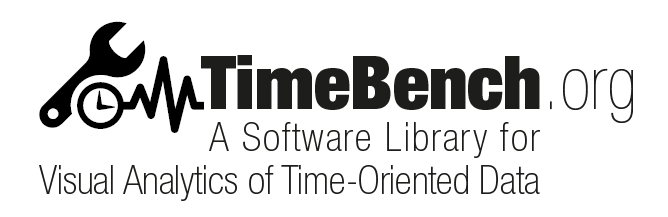

================================
 
TimeBench, a flexible, easy-to-use, and reusable software library written in 
Java that provides foundational data structures and algorithms for time-
oriented data in Visual Analytics. Thus, it eases the development and testing 
of new visualization, interaction, and analysis methods. It facilitates the 
reuse and combination of such methods and fosters their reproducibility and 
comparability.

TimeBench is licensed under the terms of a BSD 2-clause license, and can be 
freely used for both commercial and non-commercial purposes (see LICENSE).

DEMO
----

The source of several demo applications showing the library in use is included
in the `demo/` directory. 

The demos are also available via Java Web Start at
(http://www.cvast.tuwien.ac.at/TimeBench).

STRUCTURE
---------

The library distribution uses the following organization:

REQUIREMENTS
------------

TimeBench is written in Java 1.6. To compile the TimeBench code, and to build 
and run Visual Analytics prototypes, you'll need a copy of the Java Development 
Kit (JDK) for version 1.6 or greater. 

The library depends on the following packages: 

- [prefuse](https://github.com/ieg-vienna/Prefuse), with some extensions
- [Apache Commons Lang 3 classes](http://commons.apache.org/proper/commons-lang/)
- [Apache log4j 1.2](http://logging.apache.org/log4j/1.2/)
- [iCal4j 1.0.4](http://sourceforge.net/projects/ical4j/) 
- Java/R Interface (JRI), which is part of [rJava](http://www.rforge.net/rJava/)
- [ieg-util](https://github.com/ieg-vienna/ieg-util), general Java utilities
- [ieg-prefuse](https://github.com/ieg-vienna/ieg-prefuse), general prefuse extensions

We also recommended (though by no means is it required) that you use an
Integrated Development Environment such as Eclipse (http://eclipse.org).
Especially if you are a Java novice, it will likely make your life much easier.

Citation
--------

Rind, A.; Lammarsch, T.; Aigner, W.; Alsallakh, B. & Miksch, S.: 
[TimeBench: A Data Model and Software Library for Visual Analytics of Time-Oriented Data](http://www.ifs.tuwien.ac.at/~rind/preprint/rind_2013_vast_timebench.pdf), 
_IEEE Transactions on Visualization and Computer Graphics, Special Issue "VIS 2013",_ 
Vol. 19, No. 12, forthcoming, 2013.
